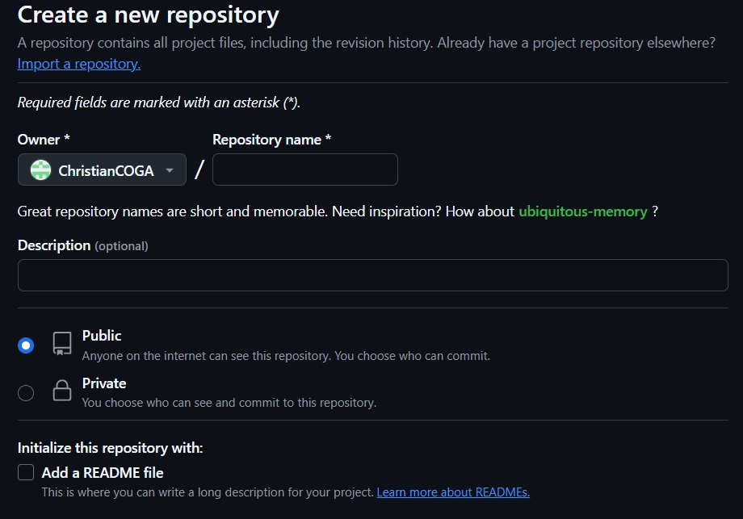
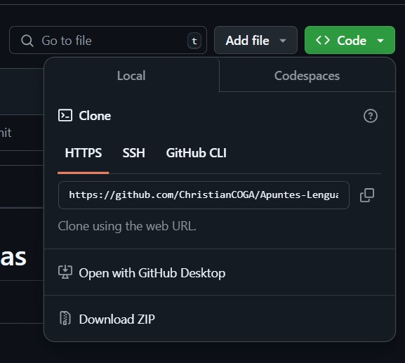
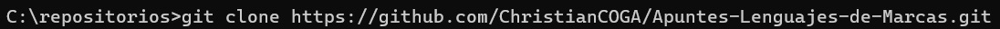

# LENGUAJES DE MARCAS - ASIX 0373
### ¿Que és **GITHUB**?
- Portal creado para alojar el código de las aplicaciones de cualquier desarrollador que usaremos especifícamente para crear nuestros repertorios. Estos los tendremos en la nube o *GitHub* los cuales podremos ir copiando y bajando copias a nuestros dispositivos locales así como a la inversa subir las modificaciones hechas en local hacia la nube gracias al *CMD* o alas herramientas de *GitHub*.
- Cada modificación de dicho repertorio lo llamaremos **Commit**.
- Tenemos la posibilidad de alternar en que sean públicos o privados nuestros repertorios.
  - Como puntualización, decir que aunque estén en público nuestros repertorios siendo estos tomados por su **URL** podrán como mucho copiarlos y modificarlos por su cuenta pero nunca modificar nuestro repertorio.

### Repertorios
- Crearemos nuestro reprtorio en *GitHub* y nos aseguraremos de copiar la URL para poder clonarlo en nuestro sistema.

- Ahora tendremos que clonarlo en nuestro dispositivo local siguiendo una serie de pasos.
  - Primero clonaríamos el repertorio de *GitHub* con el comando **git clone** hacia nuestro dispositivo local.

